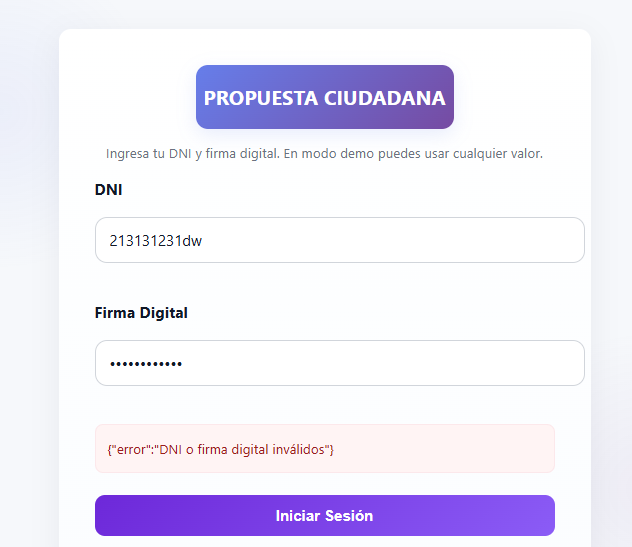
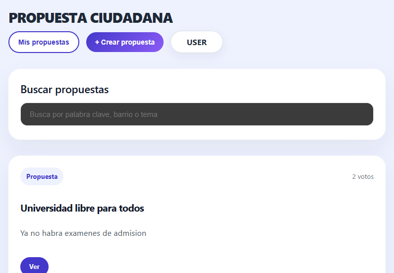
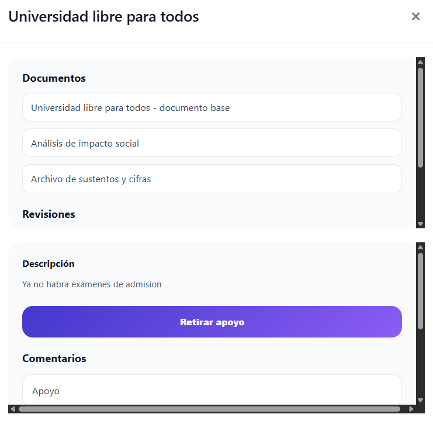
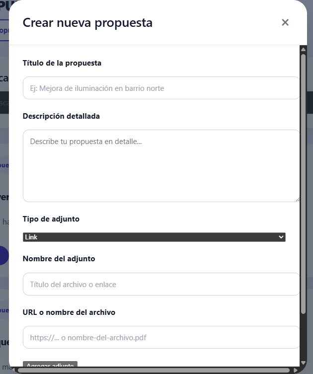
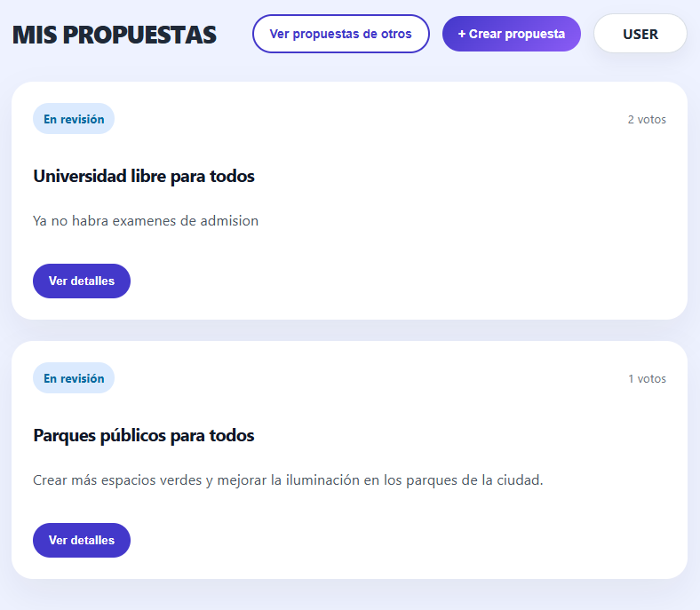
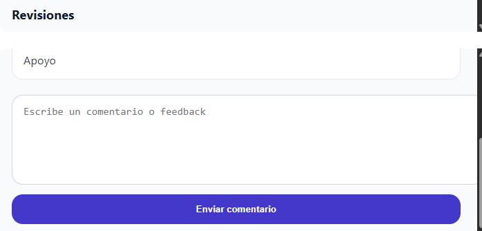
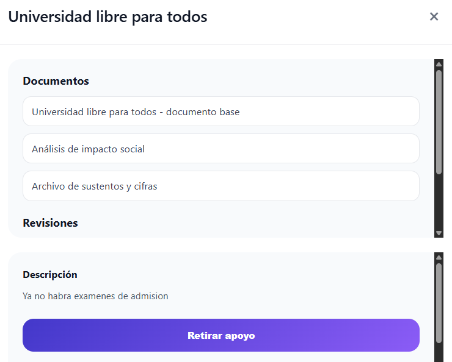

# Imágenes de Casos de Prueba

## Caso de Uso: Login

## Caso de Uso: Ver propuestas (listado)

## Caso de Uso: Ver detalle de propuesta

## Caso de Uso: Crear propuesta (con adjuntos)

## Caso de Uso: Mis propuestas

## Caso de Uso: Comentar propuesta

## Caso de Uso: Apoyar / retirar apoyo

